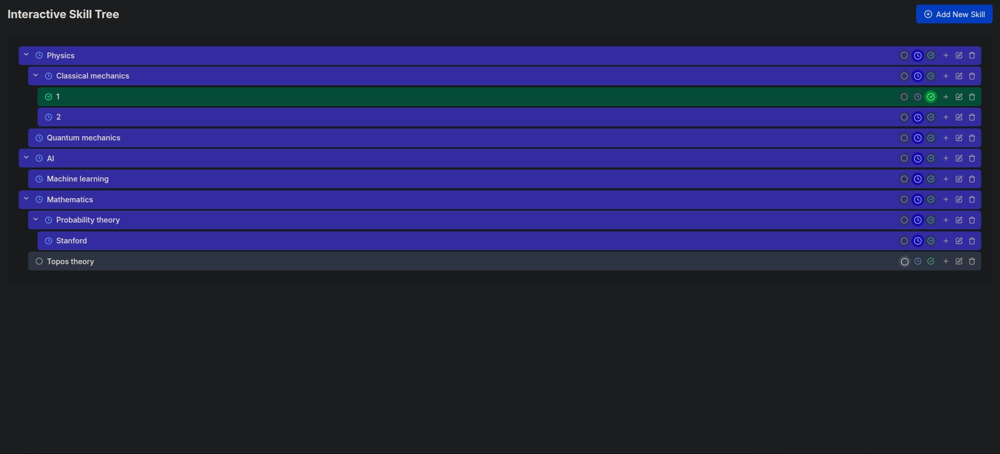

# Skill Tree Manager

An interactive web application for managing hierarchical skill trees that allows users to track their skills and progress in a visual, tree-like structure.



## Features

- **Hierarchical Skill Trees**: Build nested skill trees with skills containing sub-skills multiple levels deep
- **Interactive Interface**: Add, edit, and delete skills through an intuitive GUI
- **Progress Tracking**: Track progress with status markers (To Do, In Progress, Completed)
- **Visual Status Indicators**: Different colors indicate the status of each skill
- **Local Storage**: Your skill tree data is saved locally in your browser

## Getting Started

### Prerequisites

- Node.js 18.0.0 or later
- npm or yarn

### Installation

1. Clone the repository:
   ```
   git clone https://github.com/yourusername/skill-tree-manager.git
   cd skill-tree-manager
   ```

2. Install dependencies:
   ```
   npm install
   # or
   yarn install
   ```

3. Start the development server:
   ```
   npm run dev
   # or
   yarn dev
   ```

4. Open [http://localhost:3000](http://localhost:3000) in your browser to see the application.

## Usage

1. **Add a Skill**: Click the "Add New Skill" button to create a root-level skill
2. **Add a Sub-skill**: Click the "+" button on any skill to add a child skill
3. **Edit a Skill**: Click the edit (pencil) icon to modify a skill's details
4. **Delete a Skill**: Click the delete (trash) icon to remove a skill and all its children
5. **Expand/Collapse**: Click on a skill or its chevron icon to expand or collapse its children
6. **Change Status**: Edit a skill to update its status (To Do, In Progress, Completed)

## Technologies Used

- [Next.js](https://nextjs.org/) - React framework
- [TypeScript](https://www.typescriptlang.org/) - Type-safe JavaScript
- [Tailwind CSS](https://tailwindcss.com/) - Utility-first CSS framework
- [UUID](https://github.com/uuidjs/uuid) - For generating unique IDs
- [Lucide React](https://lucide.dev/) - Icon library

## License

This project is licensed under the MIT License - see the LICENSE file for details.

## Acknowledgements

- Built with [Next.js](https://nextjs.org/)
- Icons by [Lucide React](https://lucide.dev/)
